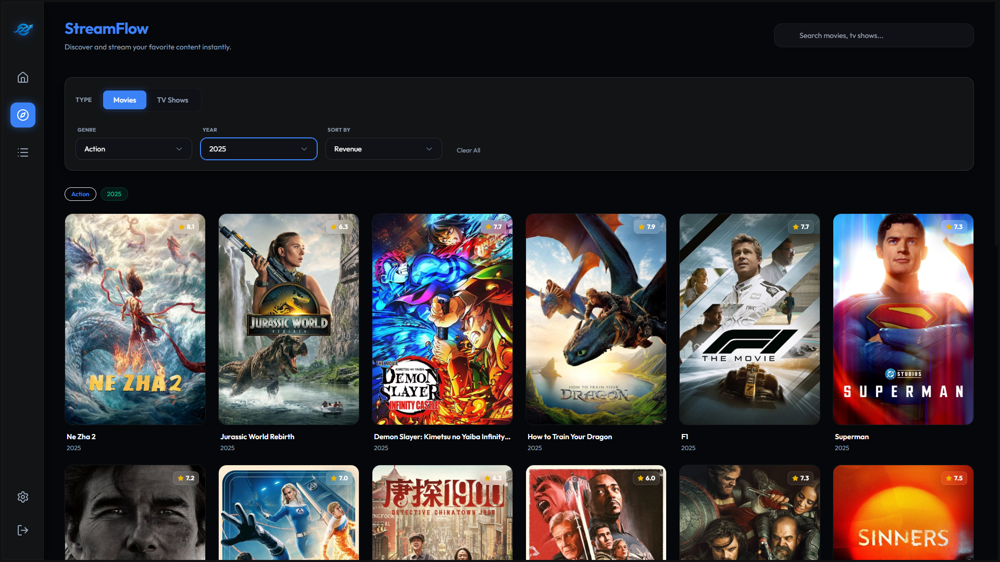
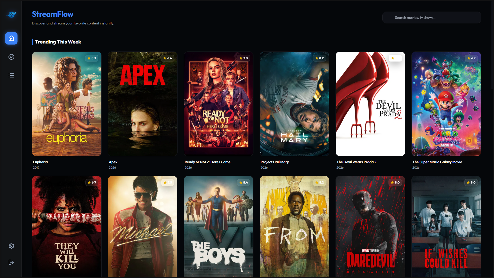

<p align="center">
  
</p>

# Stream Flow

Welcome to **Stream Flow**, a specialized **magnet link discovery and download utility**. This application integrates movie and TV show discovery with high-performance torrent searching, allowing you to quickly find magnets and launch them in your preferred system torrent client.

> [!NOTE]
> **Magnet Focused:** This application is strictly for magnet discovery. Media playback is handled by your system's default media player and torrent applications.

---

## 📸 Screenshots

<p align="center">
  
  <br />
  <em>Discovery and Trending Home Screen</em>
</p>

<p align="center">
  
  <br />
  <em>Advanced Magnet Search & Filtering</em>
</p>

---

## 🚀 How to Install and Use

### Method 1: Using Docker (Recommended)
For server administrators, NAS setups, or Linux users, Docker is the fastest and most reliable way to run Stream Flow:
1. **Pull and Run the image:**
   ```bash
   docker run -d \
     -p 7676:7676 \
     -v streamflow_data:/app/data \
     --name streamflow \
     redayasser/streamflow:latest
   ```
   > **Note:** The `-v streamflow_data:/app/data` volume is used to persist your settings, user accounts, and search configurations.
2. **Access:** Open `http://localhost:7676` in your browser.

### Method 2: Using the Windows Installer
1. **Download:** Go to the **Releases** tab on this GitHub repository and download the latest `StreamFlow Setup.exe`.
2. **Install:** Double-click the file to install the application.
3. **Run:** Once installed, Stream Flow runs as a lightweight background server and will automatically open the discovery UI in your default web browser.

### Initial Setup Requirements
When you first launch the app, you will be directed to a setup page that requires two external services:

1. **TMDB API Key (For Posters & Metadata)**: 
   - Create a free account at [themoviedb.org](https://www.themoviedb.org/).
   - Go to Account Settings > API, and copy your Developer API Key.
2. **Jackett (For Torrent Scraping)**: 
   - Jackett works as a proxy to search across multiple torrent sites simultaneously.
   - Download and install Jackett from their [GitHub Releases](https://github.com/Jackett/Jackett/releases).
   - Add your preferred torrent indexers in the Jackett dashboard.
   - Copy your Jackett API key and port (default is `9117`) and enter them into the Stream Flow setup page.

---

## 🛠️ Local Development 

If you are a developer and wish to run the app from source:

1. **Clone the project**
   ```bash
   git clone https://github.com/RedaYasserSebaa/StreamFlow
   cd StreamFlow
   ```
2. **Install NodeJS dependencies**
   ```bash
   npm install
   ```
3. **Start the application**
   ```bash
   npm start
   ```

---

## License

This project is licensed under the MIT License.
